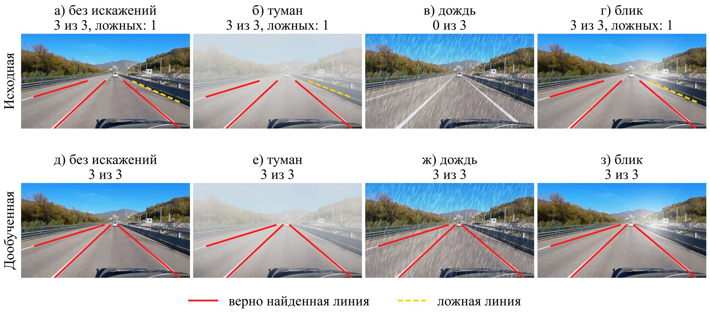
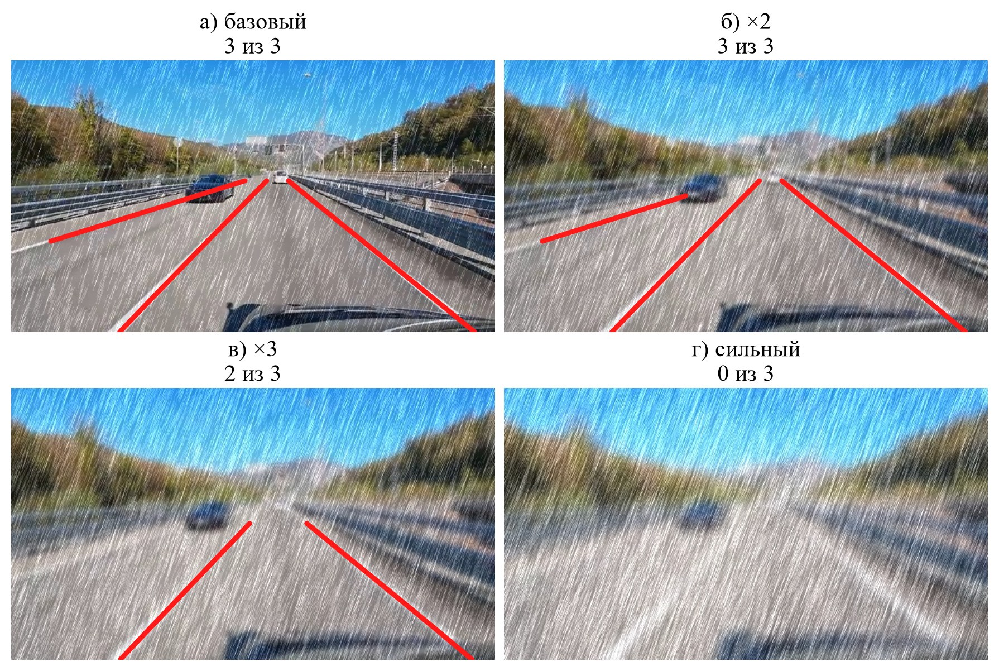
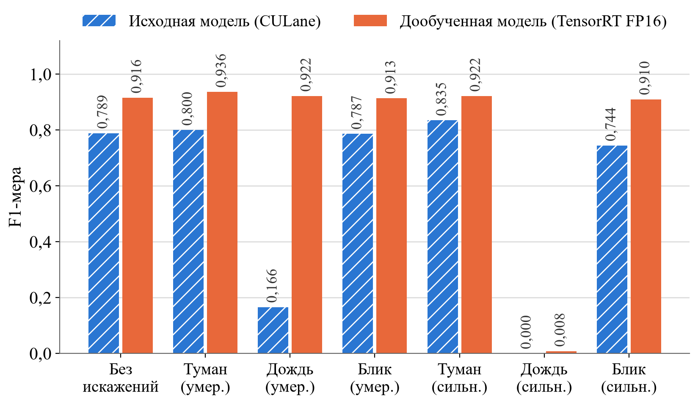

# clrnet-ru-roads (форк UnLanedet)

Форк [UnLanedet](https://github.com/zkyntu/UnLanedet) с моделью CLRNet (ResNet-34), дообученной на наборе данных
российских дорог с синтетической аугментацией погоды (туман, дождь, блик) и переведенной в TensorRT FP16.
Материалы к статье «Исследование влияния синтетической аугментации на устойчивость алгоритмов детекции
дорожной разметки к погодным искажениям».

*A fork of UnLanedet with CLRNet (ResNet-34) fine-tuned on Russian roads with synthetic weather augmentation
and converted to TensorRT FP16.*

### Пример работы

Детекция разметки исходной моделью (верхний ряд) и дообученной (нижний ряд) на одном кадре без искажений
и с синтетическими туманом, дождем и бликом. Красным показаны верно найденные линии, желтым пунктиром — ложные.

<div align="center">
  
</div>

Дообученная модель при нарастании интенсивности дождя: качество падает резко, после порога.
Модель не находит линии, но и ложных не выдает.

<div align="center">
  
</div>

### Веса

Веса не хранятся в git, они опубликованы в [Releases](https://github.com/Tatemia/clrnet-ru-roads/releases/tag/v1.0):

| Файл | Формат |
|---|---|
| `clrnet_r34_ru_roads.pth` | PyTorch, исходные веса дообученной модели |
| `clrnet_r34_ru_roads_fp16.onnx` | ONNX: backbone и FPN в FP16, голова в FP32 (для сборки движка TensorRT) |

Движок TensorRT привязан к видеокарте и версии TensorRT, поэтому собирается на месте из чекпоинта:

```bash
python tools/export_tensorrt.py config/clrnet/resnet34_culane_finetune.py checkpoints/clrnet_r34_ru_roads.pth --out-dir checkpoints/tensorrt --precisions fp16
```

### Результаты (валидационная выборка: 108 кадров, 3 сцены, протокол оценки CULane)

| Условие | F1, исходная модель (CULane) | F1, дообученная (TensorRT FP16) |
|---|---|---|
| Без искажений | 0,789 | 0,916 |
| Туман (умеренный) | 0,800 | 0,936 |
| Дождь (умеренный) | 0,166 | 0,922 |
| Блик (умеренный) | 0,787 | 0,913 |

<div align="center">
  
</div>

Время обработки кадра (RTX 3080, batch 1): 15,7 мс у исходной модели (PyTorch FP32) и 6,0 мс у дообученной (TensorRT FP16).
Искажения синтетические, поэтому результаты не гарантируют такого же качества в реальную непогоду.

### Запуск

Установка — как у UnLanedet ([doc/install.md](doc/install.md)). Детекция на изображениях и видео с
временным сглаживанием фильтром Калмана:

```bash
python tools/detect.py config/clrnet/resnet34_culane_finetune.py checkpoints/clrnet_r34_ru_roads.pth --img "images/*.jpg" --savedir vis
python tools/track_lanes_video.py config/clrnet/resnet34_culane_finetune.py checkpoints/clrnet_r34_ru_roads.pth --video input.mp4 --out compare.mp4
```

### Что добавлено и изменено относительно UnLanedet

- `unlanedet/data/transform/weather.py`, `weather_imgaug.py` — синтез тумана (закон Кошмидера), дождя и блика,
  аугментеры imgaug; подключаются в `config/clrnet/resnet34_culane_finetune.py` (`weather_aug_p`).
- `unlanedet/tracking/lane_tracker.py`, `tools/track_lanes_video.py` — трекинг полос фильтром Калмана.
- `tools/export_tensorrt.py`, `unlanedet/utils/trt_model.py` — экспорт в ONNX/TensorRT и запуск движка.
- `tools/compare_models.py`, `tools/eval_weather_robustness.py`, `tools/benchmark_speed.py` — оценка
  устойчивости к искажениям и замер скорости.
- `tools/cvat_*.py`, `tools/predict_to_cvat.py`, `tools/gen_culane_*.py`, `tools/extract_video_frames.py` —
  подготовка и разметка собственного набора данных в формате CULane.
- Изменены файлы UnLanedet: `unlanedet/model/CLRNet/clr_head.py` (ускорена постобработка),
  `unlanedet/data/transform/__init__.py` (регистрация погодных аугментаций), `tools/detect.py`
  (подгонка размера кадра под конфиг).

Набор данных российских дорог в репозиторий не входит.

Лицензия Apache 2.0.

---

# UnLanedet
<font size=4> An advanced lane detection toolbox. UnLanedet contains many advanced lane detection methods to facilitate scientific research and lane detection applications. If you are in China, [gitee](https://gitee.com/zkyseured/UnLanedet) link may be helpful for you.

<div align="center">
  
</div>
<br>

## What's New 
* <font size=3> [2025-11-17] The code of DiffusionLane has been released. Enjoy it!
* <font size=3> [2025-10-28] We propose a novel generative diffusion-based framework for lane detection, named DiffusionLane. Arxiv paper is [here](https://arxiv.org/abs/2510.22236). Code and model will be released in the next few weeks.
* <font size=3> [2025-07-18] We release the technical report of UnLanedet: [paper_link](https://www.preprints.org/manuscript/202507.1610/v1).
* <font size=3> [2025-07-18] The latest distributed training code is provided. [PR link](https://github.com/zkyntu/UnLanedet/pull/53). Many thanks to the author.
* <font size=3> [2025-05-30] We support DLA34 and ConvNexT backbone. CLRNet with ConvNext-Tiny gets 80.21 F1 score on CULane.
* <font size=3> [2025-05-27] We support GSENet and provide the [model analysis tools](./tools/analysis.py).
* <font size=3> [2025-05-23] We support GANet, a keypoint-based method, and modulated DCN in mmcv.
* <font size=3> [2025-05-14] We release v3 version. In this version, we support BezierNet, a parameter-based method.
* <font size=3> [2025-05-07] We support SRLane, a high-performance model with fast inference speed. Training on the custom dataset is provided in the advanced usage.
* <font size=3> [2025-04-24] We support distributed training (DDP) and provide the CLRNet-R50 model.
* <font size=3> [2025-03-12] We release the v2 version. In this version, we add the VIL100 dataset and the ADNet-VIL100 model and provide the [fps testing tool](./tools/test_speed.py). In the future, we will add O2SFormer, keypoint-based methods, and parameter-based methods. Stay tuned.
* <font size=3> [2025-03-04] We release the [Timm library wrapper](unlanedet/model/module/backbone/timm_wrapper.py)! Users can directly transfer the advanced backbone to UnLanedet. In the following weeks, we will release the v2 version.
* <font size=3> [2024-11-10] We release ADNet and LaneATT. Try it!
* <font size=3> [2024-11-07] We release CondLaneNet and CLRerNet and fix bugs in UnLanedet. Try it!
* <font size=3> [2024-11-05] We release the v1 version, focusing on 2D lane detection methods.

## Installation
<font size=3> See [installation instructions](doc/install.md).

## Getting Started
<font size=3> See [Get Started documentation](scripts/TRAIN.md), including the data preparation, the training code, the evaluation code, the resume code, the inference code, and the advanced usage.

## Model Zoo and Baselines
We provide a set of lane detection methods. All models and the corresponding weights and the training logs can be found in the [Model Zoo](doc/model_zpp.md).

## Advantages of UnLanedet
Compared with other lane detection libraries, e.g., lanedet and PPLanedet, UnLanedet has two obvious advantages: 1) Distributed training is supported. 2) More pretrained models and datasets are provided.

We do not depend on third-party library, such as mmcv series, and all modules and functions can be found in the repo.

## License
UnLanedet is released under the Apache 2.0 license.

## Contribution
We appreciate all contributions to UnLanedet and welcome pull requests to improve UnLanedet.

## Acknowledgement
UnLanedet is built upon [detectron2](https://github.com/facebookresearch/detectron2), [lanedet](https://github.com/Turoad/lanedet) and [PPLanedet](https://github.com/zkyseu/PPlanedet). Many thanks to their great work!

The code of BeizerNet is modified from [mmLaneDet](https://github.com/Yzichen/mmLaneDet). Many thanks to the authors.

Some modules are borrowed from [detrex](https://github.com/IDEA-Research/detrex). Many thanks to the authors.

## Citing UnLanedet
If you use UnLanedet in your research, please use the following BibTeX entry.

```BibTeX
@misc{zhouunlanedet,
  author =       {UnLanedet team},
  title =        {UnLanedet},
  howpublished = {\url{https://github.com/zkyntu/UnLanedet}},
  year =         {2024}
}
```
